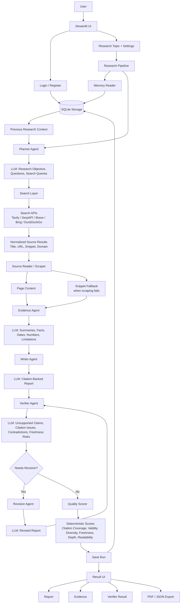

# ResearchGraph AI

ResearchGraph AI is a multi-agent research assistant that turns a topic into a cited research report. It plans the research, searches public sources, extracts evidence, writes a structured report, verifies claims, scores quality, and saves the result to user history.

## Features

- Login and registration
- Per-user research history
- Live agent status during a research run
- Multi-provider web search
- Source reading with snippet fallback
- Evidence extraction from sources
- Citation-backed report generation
- Verifier checks for unsupported claims and citation issues
- Automatic revision for weak reports
- Deterministic quality scoring
- SQLite-backed memory and history
- PDF and JSON exports

## Architecture



The system is organized around a single research pipeline. The UI collects the topic and configuration, then the pipeline coordinates memory lookup, planning, web search, source reading, evidence extraction, writing, verification, scoring, and persistence.

**Interface Layer**

Streamlit handles login, registration, research input, live agent status, history, result viewing, and exports. FastAPI is available separately for API-style access.

**Orchestration Layer**

The pipeline controls the order of work, tracks progress, handles scraping/search fallbacks, and saves the completed run. A LangGraph-compatible workflow is included for graph-style orchestration, while the Streamlit app can run through the simpler sequential path for easier deployment.

**Agent Layer**

The agent layer separates the research task into focused responsibilities:

- Planner Agent creates research questions and search queries.
- Evidence Agent extracts structured facts from each source.
- Writer Agent creates the cited report.
- Verifier Agent checks citations, unsupported claims, contradictions, and freshness risks.
- Revision Agent rewrites weak reports when verification fails or quality is low.

**Source Layer**

Search is provider-agnostic. The app can use Tavily, SerpAPI, Brave, Serper, Bing, DuckDuckGo, or a custom search endpoint. Search results are normalized into one internal format before scraping and evidence extraction.

**Persistence Layer**

SQLite stores users, research history, saved run payloads, memory snippets, background jobs, and search cache. Each user sees their own saved research history.

**Export Layer**

Completed research can be exported as PDF or JSON. Reports preserve citations and include source-backed evidence.

## Tech Stack

- Python
- Streamlit
- FastAPI
- SQLite
- LangChain
- LangGraph-compatible workflow
- ReportLab

## Local Setup

```bash
python -m venv venv
```

Windows:

```bash
venv\Scripts\activate
```

macOS/Linux:

```bash
source venv/bin/activate
```

Install dependencies:

```bash
pip install -r requirements.txt
```

Create a local `.env` file:

```env
LLM_PROVIDER=groq
GROQ_API_KEY=your_groq_key
GROQ_MODEL=llama-3.1-8b-instant

SEARCH_PROVIDER=auto
TAVILY_API_KEY=your_tavily_key

DEFAULT_MAX_SOURCES=6
MAX_REVISIONS=1
```

Run the app:

```bash
streamlit run app.py
```

## Provider Configuration

LLM providers are selected with `LLM_PROVIDER`.

Supported providers:

```text
gemini, openai, anthropic, groq, openrouter, together, ollama, custom
```

Search providers are selected with `SEARCH_PROVIDER`.

Supported providers:

```text
auto, tavily, serpapi, brave, serper, bing, duckduckgo, custom, none
```

In `auto` mode, search uses the first available provider key in this order:

```text
Tavily -> SerpAPI -> Brave -> Serper -> Bing -> DuckDuckGo
```

## FastAPI

The Streamlit app is the main interface. An optional FastAPI backend is available:

```bash
uvicorn api:app --reload
```

API docs:

```text
http://127.0.0.1:8000/docs
```

## Data Storage

The app uses SQLite for users, history, saved runs, memory snippets, and search cache. This keeps setup simple, but on free hosting platforms the database may reset after app restarts or redeploys.

For persistent production data, use a managed database such as Postgres or Supabase.

## Limitations

- Report quality depends on retrieved sources and model behavior.
- Verification reduces unsupported claims but does not guarantee perfect accuracy.
- Some websites block scraping, so the app may rely on search snippets.
- Free LLM or search APIs may hit rate limits.
- SQLite is best for demos and small deployments, not large multi-user production.
